## 插件使用

pytest的插件非常的多，截止目前将近 1500 个插件。

Pytest Plugin List: https://docs.pytest.org/en/stable/reference/plugin_list.html

注：这些插件是PyPI上可用的pytest插件的自动编译。它包括名称以`pytest-`或`pytest_`开头的PyPI项目，以及一些手动选择的项目。归类为非活动的包不包括在内。

这么多插件肯定是良莠不齐的，也并不是所有功能都会用得到的，我们这里挑选一些最为常用的介绍其使用。

### pytest-html

pytest-HTML是pytest的一个插件，它为测试结果生成HTML报告。

#### 安装与使用

**安装：**

```shell
> pip install pytest-html
```

**使用**

* 使用示例

```py
import pytest


def test_pass():
    """用例通过"""
    assert True


def test_fail():
    """用例失败"""
    assert False


def test_error():
    """用例错误"""
    raise Exception("这是一个错误")


@pytest.mark.skip(reason="这是一个跳过的用例")
def test_skip():
    """用例跳过"""
    assert True
```

* 运行结果

```shell
> pytest --html=report.html
```

* 查看报告

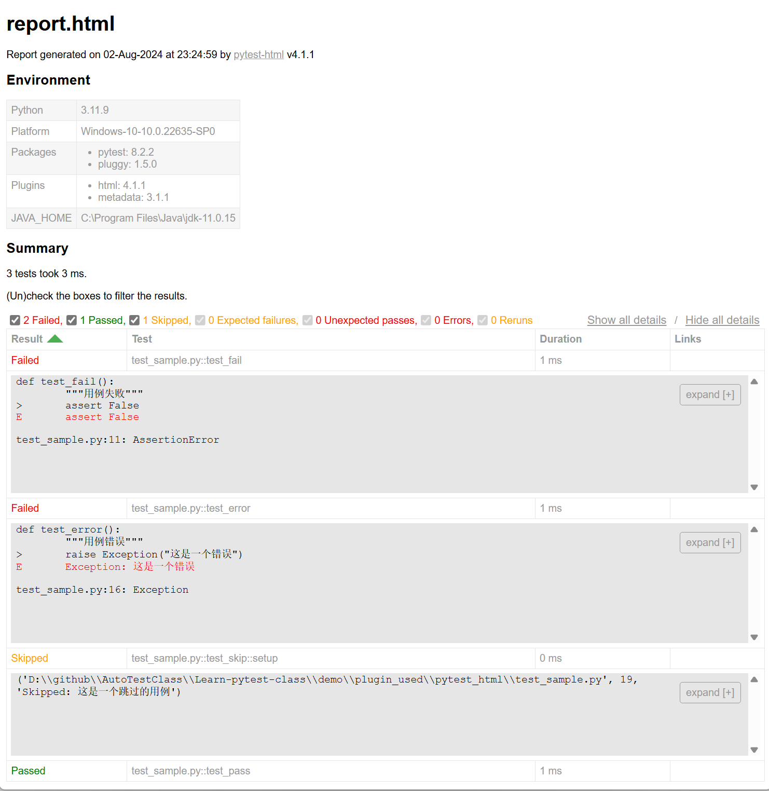

#### HTML报告支持log

默认情况下我们无法将 log 日志信息打印到报告中，但是，大多数时候我们需要在报告中看log日志信息。

可以通过下面的配置实现这个功能呢。

* pytest.ini 配置日志格式

```ini
[pytest]
log_format = %(asctime)s %(levelname)s %(message)s
log_date_format = %Y-%m-%d %H:%M:%S
```

* conftest.py 配置日志级别

```py
import logging


def pytest_configure(config):
    # 配置日志  
    logging.basicConfig(level=logging.INFO)
```

* 测试用例中使用日志

```py
# test_log.py

import logging


def test_example():
    logging.info("这是一条测试用例的日志信息")
    logging.warning("这是一条告警信息")
```

* 运行结果

```shell
> pytest --html=report.html test_log.py
```

* 查看报告截图

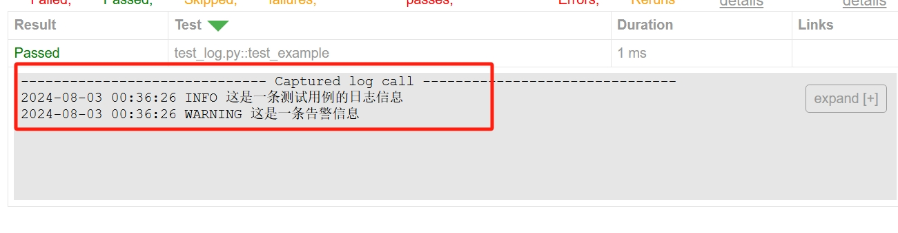

#### 实时生成报告

为了实时生成测试结果报告，即每个测试完成后立即生成对应的报告部分，而不是等待整个测试运行完全结束后才生成报告。

* pytest.ini 配置

```ini
[pytest]  
generate_report_on_test = True
```

* 测试示例

```py
from time import sleep


def test_one():
    sleep(3)


def test_two():
    sleep(2)


def test_three():
    sleep(4)
```

下面是一组运行缓慢的用例，当第一条用例运行完成后会生成测试报告。之后运行的每条用例的结果会`追加`到这个报告中。

>
虽然实时生成报告可以带来更好的用户体验，但请注意，这可能会稍微影响测试的整体执行时间，因为每次测试完成后都需要更新HTML文件。此外，如果测试运行时间非常长，或者测试数量非常多，生成的HTML文件可能会变得相当大，这可能会影响其加载速度和可读性。因此，在使用此功能时，请根据你的具体需求和环境进行权衡。

#### 自定义报告标题

默认情况下，报告标题将是报告的文件名，可以通过使用 `pytest_html_report_title` 钩子来编辑它：

conftest.py 配置

```py
def pytest_html_report_title(report):
    report.title = "My very own title!"
```

#### 创建自包含的报告

为了遵守内容安全策略（CSP），默认情况下，诸如CSS和图像等若干资源会分开存储。

* 运行测试

```shell
> pytest --html=report.html  test_sample.py
```

* 生成目录

```shell
├─── test_sample.py
├─── report.html
└───assets
    └───style.css
```

作为替代方案，我们也可以创建一个自包含报告，这在分享结果时可能更为方便。

* 运行测试

```shell
> pytest --html=report.html --self-contained-html test_sample.py
```

* 生成目录

```shell
├─── test_sample.py
├─── report.html
```

#### HTML报告支持截图

默认情况下我们无法将截图信息打印到报告中，但是，大多数时候我们需要在报告中看截图信息。

要实现这个功能需要和响应的UI自动化测试库做配合。这里以 selenium 为例。

* pip安装 selenium 库。

```shell
pip install selenium
```

* conftest.py配置

```py
import pytest
from selenium.webdriver import Chrome


@pytest.fixture(scope="session", autouse=True)
def browser():
    global driver
    driver = Chrome()

    yield driver

    driver.quit()


@pytest.hookimpl(hookwrapper=True)
def pytest_runtest_makereport(item, brw):
    """
    用于向测试用例中添加用例的开始时间、内部注释，和失败截图等.
    :param item:
    """
    global driver
    pytest_html = item.config.pluginmanager.getplugin('html')
    outcome = yield
    report = outcome.get_result()
    extra = getattr(report, 'extra', [])
    if report.when == 'call' or report.when == "setup":
        xfail = hasattr(report, 'wasxfail')
        if (report.skipped and xfail) or (report.failed and not xfail):
            case_path = report.nodeid.replace("::", "_") + ".png"
            if "[" in case_path:
                case_name = case_path.split("-")[0] + "].png"
            else:
                case_name = case_path
            img_base64 = "data:image/jpg;base64," + driver.get_screenshot_as_base64()

            if img_base64:
                html = '<div></div>' % img_base64
                extra.append(pytest_html.extras.html(html))
        report.extras = extra
```

代码说明:

`browser` 定义selenium 浏览器驱动。
`pytest_runtest_makereport` 钩子函数可以在用例运行结束的时候完成一些操作。核心就是两步：1. 通过selenium 驱动截取到图片，2.
如何将图片插入到 HTML 报告中。

* 测试示例

```py
def test_bing(browser):
    browser.get("http://www.bing.com")
    title = browser.title
    assert title == "bing"
```

* 运行测试

```shell
> pytest -vs --html=report-selenium.html test_selenium.py

================================= test session starts ===============================

test_selenium.py::test_bing
DevTools listening on ws://127.0.0.1:5634/devtools/browser/c9d0af90-7655-4f0e-bfc2-ef16c6b50992
FAILED

================================== FAILURES =========================================
_________________________________ test_bing _________________________________________

browser = <selenium.webdriver.chrome.webdriver.WebDriver (session="f67e09a853b8a41910e7f2d97e8ebe2e")>

    def test_bing(browser):
        browser.get("http://www.bing.com")
        title = browser.title
>       assert title == "bing"
E       AssertionError: assert '必应' == 'bing'
E
E         - bing
E         + 必应

test_selenium.py:4: AssertionError

============================== short test summary info ==============================
FAILED test_selenium.py::test_bing - AssertionError: assert '必应' == 'bing'
=========================== 1 failed, 1 warning in 7.82s ============================
```

* 生成报告

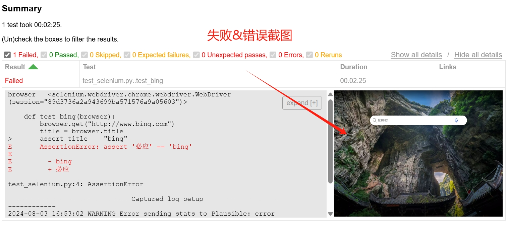

#### 修改结果表

你可以通过为报告的标题和行实现自定义钩子来修改报告的列。以下示例 `conftest.py`
添加了一个描述列，包含测试函数的文档字符串，添加了一个可排序的时间列，并移除了链接列：

* conftest.py 配置

```py
import pytest
from datetime import datetime


def pytest_html_results_table_header(cells):
    cells.insert(2, "<th>Description</th>")
    cells.insert(1, '<th class="sortable time" data-column-type="time">Time</th>')


def pytest_html_results_table_row(report, cells):
    cells.insert(2, f"<td>{report.description}</td>")
    cells.insert(1, f'<td class="col-time">{datetime.utcnow()}</td>')


@pytest.hookimpl(hookwrapper=True)
def pytest_runtest_makereport(item, call):
    outcome = yield
    report = outcome.get_result()
    report.description = str(item.function.__doc__)
```

* 运行测试

```shell
> pytest -vs --html=report.html test_log.py
```

* 生成报告

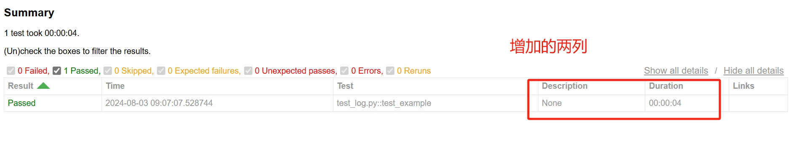

### allure-pytest

Allure框架是一套适配器和示例，用于Allure报告，这是一个灵活、轻量级的多语言测试报告工具。

allure 支持各种编程语言下面的的测试框架，包括：java、python、js、ruby和c# 等。

* python项目

https://github.com/allure-framework/allure-python

#### 安装allure命令

allure本身是一个解析测试报告的命令行工具，需要安装allure命令才能使用。

您可以通过以下方式之一获取 Allure：

* 安装包安装：

https://github.com/allure-framework/allure2/releases

* 使用 Homebrew：

```shell
$ brew install allure
```

* 使用 scoop：

对于 Windows，Allure 可以通过 Scoop 命令行安装程序获取。要安装 Allure，请下载并安装 Scoop，然后在 Powershell 中执行：

```shell
> scoop install allure
```

#### 使用allure报告

使用allure的核心是让pytest生成allure能解析的数据格式。

* 安装allure-pytest库

```shell
$ pip install allure-pytest
```

* 运行测试，并生成allure数据

```shell
$ pytest --alluredir=%allure_result_folder% 
```

生成目录：

```
├───test_sample.py
└───%allure_result_folder%
    |───xxx.json
    |───yyy.json
    └───zzz.json
```

`%allure_result_folder%` 这些目录下面的JSON数据记录了用例的执行信息。

* allure 服务

```shell
$ allure serve %allure_result_folder%

Generating report to temp directory...
Report successfully generated to C:\Users\fnngj\AppData\Local\Temp\7976221059831703393\allure-report
Starting web server...
2024-08-03 17:36:08.208:INFO::main: Logging initialized @3220ms to org.eclipse.jetty.util.log.StdErrLog
Server started at <http://192.168.43.203:8976/>. Press <Ctrl+C> to exit
```

* 生成报告

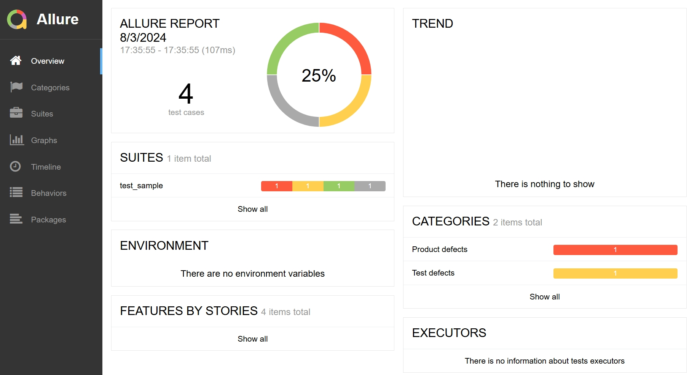


#### 编写测试

参考文档：https://allurereport.org/docs/pytest/

Allure Pytest 适配器不仅收集 pytest 标准特性所提供的数据，还提供了额外的功能，帮助您编写更好的测试。本节列出了使用 pytest 和 Allure Pytest 特性改进测试的几种最显著的方法。

使用 Allure Pytest，您可以：
- 提供描述、链接和其他元数据，
- 将测试组织成层次结构，
- 将测试细分为更小的、易于阅读的测试步骤，
- 描述运行参数化测试时使用的参数，
- 为 fixtures 添加可读标题，
- 使测试在执行期间保存屏幕截图和其他文件，
- 通过测试计划文件选择要运行的测试。

##### 指定描述、链接和其他元数据

您可以向每个测试添加大量元数据，以便它们在报告中显示。有关更多详细信息，请参阅参考文档。

对于每个元数据字段，有多种方法可以分配它。
- 在测试函数体内调用 Allure 的函数。这种方法称为“动态”，因为它允许您在将值传递给方法之前，在运行时构造字符串和其他值。
- 使用 Allure 的函数作为测试函数或测试类的装饰器。
- 将 Allure 的函数作为 pytest 标记添加到模块或包（请参阅 pytest 文档中的标记整个类或模块部分）。

> 如果您使用装饰器或 pytest 标记设置字段，则随后可以根据某些元数据字段选择和运行测试，请参阅影响测试选择的选项。

```python
import allure

@allure.title("测试认证")
@allure.description("此测试尝试使用登录名和密码登录网站。如果发生任何错误则失败。\n\n注意，此测试不测试双因素认证。")
@allure.tag("新界面", "基础", "认证")
@allure.severity(allure.severity_level.CRITICAL)
@allure.label("owner", "John Doe")
@allure.link("https://dev.example.com/", name="网站")
@allure.issue("AUTH-123")
@allure.testcase("TMS-456")
def test_authentication():
    ...
```

##### 组织测试

如在测试报告中改进导航所述，Allure 支持多种将测试组织成层次结构的方法。Allure Pytest 提供函数，通过添加装饰器或标记或调用“动态”函数（与元数据字段相同），分配相关字段到测试。

要指定测试在基于行为的层次结构中的位置：

```python
import allure

@allure.epic("Web 界面")
@allure.feature("基础功能")
@allure.story("认证")
def test_story_level():
    ...
```

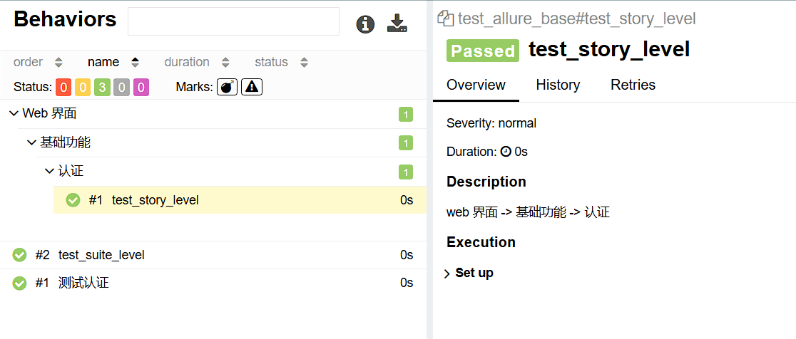

要指定测试在基于套件的层次结构中的位置：
```python
import allure

@allure.parent_suite("Web 界面测试")
@allure.suite("基础功能测试")
@allure.sub_suite("认证测试")
def test_suite_level():
    ...
```

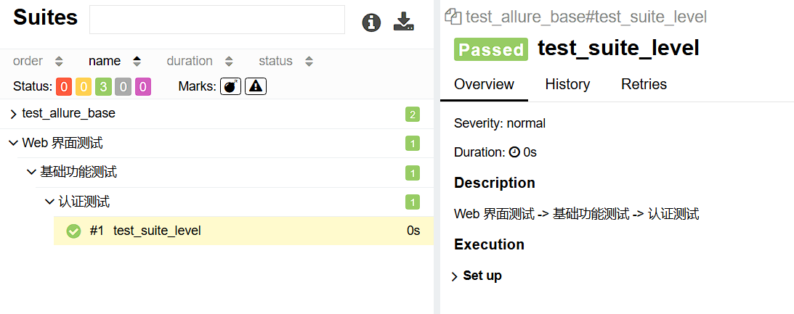

测试在基于包的层次结构中的位置由它们声明的类和函数的完全限定名称定义，公共前缀显示为父包。

##### 将测试细分为步骤

Allure Pytest 提供了两种创建步骤和子步骤的方法：“装饰步骤”和“上下文步骤”，都通过 `allure.step()` 实现。

```python
import allure

def test_example():
    steps = Steps()
    steps.step1()
    steps.step2()

class Steps:
    @allure.step("步骤 1")
    def step1(self):
        ...

    @allure.step("步骤 2")
    def step2(self):
        ...
```

步骤同样支持传参：

```python
def test_login():
    step = Login()
    step.step_with_input("admin", "pw123")
    step.step_with_click("登录")


class Login:
    @allure.step("输入用户名和密码: {first} and {second}")
    def step_with_input(self, first="first", second="second"):
        print(f"输入用户名{first}")
        print(f"输入用密码{second}")

    @allure.step("点击{1}按钮.")
    def step_with_click(self, first):
        print(f"点击{first} 按钮")
```

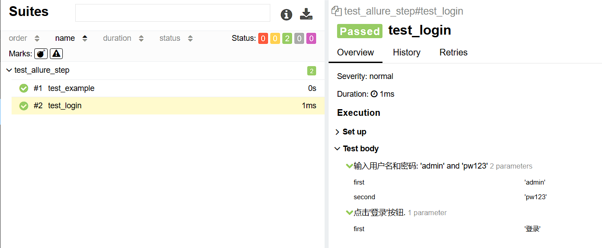

##### 描述参数化测试

当使用参数化测试模式时，Allure Pytest 自动将参数值添加到测试报告中。Allure 支持 pytest 支持的所有参数化测试方法，包括为 fixtures 声明参数。

此外，您可以：
- 将参数的值纳入测试标题，请参阅 `title()`；
- 手动添加一个伪参数，请参阅 `parameter()`。
- 用更易读的表示法覆盖参数的值，请参阅 `parameter()`。

```python
from os.path import basename, expanduser

import allure
import pytest

@pytest.mark.parametrize("login", [
    "johndoe",
    "johndoe@example.com",
])
# @allure.title("Test Authentication (as {login})") # 将参数纳入标题
def test_authentication(login):
    ...

def test_authentication_with_empty_login():
    allure.dynamic.parameter("login", "(空)")
    ...

@pytest.mark.parametrize("ssh_key", [
    expanduser("~/.ssh/id_rsa1"),
    expanduser("~/.ssh/id_rsa2"),
    expanduser("~/.ssh/id_rsa3"),
])
def test_authentication_with_ssh_key(ssh_key):
    allure.dynamic.parameter("ssh_key", basename(ssh_key))
    ...
```

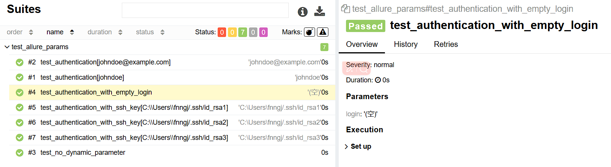

##### 描述 fixtures

pytest 的 **fixtures** 概念为每个测试提供了一种方法，只需通过指定函数参数名称来定义它所需的特性。一些 fixtures 由 pytest 自身提供，其他可以由额外的库或您自己的代码提供。有关更多详细信息，请参阅 pytest 文档。

在测试报告中显示测试时，Allure 显示与 fixtures 相关的操作类似于它显示测试步骤的方式。为了更容易理解 fixture 的目的，您可以使用 `@allure.title()` 装饰器指定其标题。

```python
import allure
import pytest

@pytest.fixture()
@allure.title("为测试做准备")
def my_fixture():
    ...  # 设置
    yield
    ...  # 拆除
def test_with_my_fixture(my_fixture):
    ...
```

##### 附加屏幕截图和其他文件

您可以将各种类型的文件附加到您的 Allure 报告中。例如，使报告更容易理解的一种流行方法是在某个特定点附加用户界面的屏幕截图。为此，请使用 `allure.attach()` 或 `allure.attach.file()`。

1. **`allure.attach()`**：
   - 这个方法主要用于在测试报告中附加文本信息、截图、或HTML内容等。
   - 它不仅限于文件，也可以用于直接在报告中嵌入字符串或HTML格式的内容。
   - 当需要向报告中添加一些执行中的动态信息或数据时，这个方法非常有用。

2. **`allure.attach.file()`**：
   - 这个方法是 `allure.attach()` 的一个特化版本，专门用于附加文件到测试报告中。
   - 它主要用于附加静态文件，如截图、视频或数据文件等。
   - 与 `allure.attach()` 相比，`allure.attach.file()` 提供了更清晰的语义，表示正在附加一个文件。

`allure.attach()` 是一个更通用的方法，可用于附加文本、HTML和文件等内容，而 `allure.attach.file()` 是专门用于附加文件的便捷方法，提供了更清晰的API。在实际使用中，你可以根据具体需求选择使用哪一个。

__准备工作__

这里以`playwright`为例。

* 安装pytest-playwright

```shell
> pip install pytest-playwright
```

* 安装chromium浏览器

```shell
> playwright install chromium
```

__使用示例__


```python
import allure
from pathlib import Path


def test_attach(page):
    page.goto("https://playwright.dev/")
    png_bytes = page.screenshot()
    allure.attach(
        png_bytes,
        name="full-page",
        attachment_type=allure.attachment_type.PNG
    )


def test_attach_file(page):
    page.goto("https://playwright.dev/")
    png_bytes = page.screenshot()
    Path("full-page.png").write_bytes(png_bytes)
    allure.attach.file(
        "full-page.png",
        name="full-page",
        attachment_type=allure.attachment_type.PNG
    )

```

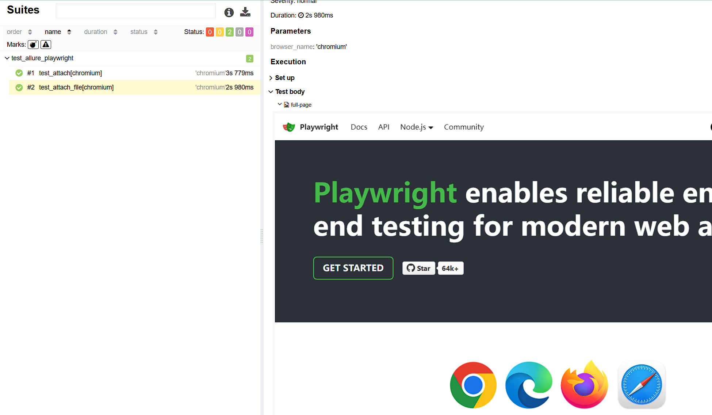

__附加数据__

默认情况下，Allure Pytest 将以下数据作为附加伪文件添加：

| 附件名称 | 内容                                                                   |
| -------- | ---------------------------------------------------------------------- |
| `stdout` | 所有写入 `sys.stdout` 的数据，例如通过 `print(...)`。                  |
| `stderr` | 所有写入 `sys.stderr` 的数据，例如通过 `print(..., file=sys.stderr)`。 |
| `log`    | 所有记录到标准日志机制的数据，例如通过 `logging.debug(...)`。          |

此行为可以通过 `--allure-no-capture` 选项禁用。

##### 通过测试计划文件选择测试

如果定义了 `ALLURE_TESTPLAN_PATH` 环境变量并指向一个存在的文件，pytest 将只运行此文件中列出的测试。

以下是根据名为 `testplan.json` 的文件运行测试的示例：

```sh
export ALLURE_TESTPLAN_PATH=testplan.json
python -m pytest
```

##### 环境信息

对于报告的主页，您可以收集有关执行测试的环境的各种信息。

例如，使用此功能记住操作系统版本和 Python 版本是一个好主意。这可能有助于未来的读者调查仅在某些环境中可重现的错误。

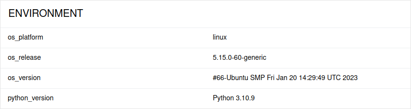

要提供环境信息，请在运行测试后将名为 `environment.properties` 的文件放入 `allure-results` 目录中。请参阅环境文件中的示例。

请注意，此功能应用于报告中所有测试的属性不发生变化的情况。如果您有对不同测试可能不同的属性，请考虑使用参数化测试。


### pytest-base-url

pytest-base-url是一个pytest插件，它允许你为测试用例设置一个默认的URL。

当我们需要重复使用一个基础URL，`pytest-base-url` 提供了一个 `base_url` 的（fixture），该fixture返回指定的基础URL。

使用场景：

- [x] web 测试
- [x] api 测试

* pip安装`pytest-base-url`。

```shell
> pip install pytest-base-url
```

* 使用示例

```py
import urllib


def test_example(base_url):
    assert 200 == urllib.urlopen(base_url).getcode()
```

**使用命令行**

你可以在命令行中指定基础URL：

```shell
> pytest --base-url=https://httpbin.org/get
```

**使用配置文件**

你也可以在配置文件中指定基础URL。

* `pytest.ini`配置

```shell
[pytest]  
base_url = https://httpbin.org/get
```

### pytest-rerunfailures

pytest-rerunfailures 是一个针对 pytest 的插件，用于重新运行测试，以消除间歇性失败。

* pip安装`pytest-rerunfailures`。

```shell
> pip install pytest-rerunfailures
```

#### 重跑所有失败用例

要重新运行所有测试失败。支持的类型：

- [x] 测试用例错误(代码错误)。
- [x] 测试用例失败(断言失败)。
- [x] fixture失败&错误。
- [x] setup_class失败&错误。

* 测试示例

```py
import pytest


@pytest.fixture
def cleanenv():
    a


def test_error():
    with open("abc.txt") as f:
        pass


def test_fail():
    assert 2 + 2 == 3


def test_fixture_error(cleanenv):
    pass


class TestClass:

    @classmethod
    def setup_class(cls):
        b

    def test_case(self):
        assert True
```

使用 `--reruns` 命令行选项，并指定您希望测试运行的最大次数：

```shell
> pytest -vs --reruns 2  test_sample.py

....

test_sample.py::test_error RERUN
test_sample.py::test_error RERUN
test_sample.py::test_error FAILED
test_sample.py::test_fail RERUN
test_sample.py::test_fail RERUN
test_sample.py::test_fail FAILED
test_sample.py::test_fixture_error RERUN
test_sample.py::test_fixture_error RERUN
test_sample.py::test_fixture_error ERROR
test_sample.py::TestClass::test_case RERUN
test_sample.py::TestClass::test_case RERUN
test_sample.py::TestClass::test_case ERROR
...

```

要在重新运行之间添加延迟时间，请使用 `--reruns-delay` 命令行选项，并指定您希望在下次测试重新运行之前等待的秒数：

```shell
> pytest --reruns 5 --reruns-delay 1 test_sample.py
```

#### 重新运行 - 排除某中类型的错误&失败

重新运行，如果想`排除`或`执行` 某种类型的错误，可以通过下面方式：

- [x]  `--rerun-except` 排除某中类型的错误。
- [x]  `--only-rerun` 只重新运行某中类型的错误。

* 测试示例

```py
def test_pass():
    """这个测试会成功"""
    assert True


def test_always_fail():
    """这个测试总是失败，并且抛出的是TypeError，应该被重新运行"""
    raise TypeError("This is a TypeError")


def test_assert_error():
    """这个测试失败时抛出AssertionError，根据配置不应该被重新运行"""
    assert False, "This is an AssertionError"


def test_os_error():
    """这个测试失败时抛出OSError，根据配置也不应该被重新运行"""
    raise OSError("This is an OSError")


def test_runtime_error():
    """这个测试失败时抛出RuntimeError，应该被重新运行"""
    raise RuntimeError("This is a RuntimeError")
```

例如，以下命令将排除 `AssertionError` 错误的用例的重跑：

```sh
$ pytest --reruns 2 --rerun-except AssertionError
```

例如，以下命令将只重新运行 `AssertionError` 错误的用例：

```sh
$ pytest --reruns 2 --only-rerun AssertionError
```

多次传递标志将累积参数，所以以下命令将只重新运行与 `AssertionError` 或 `OSError` 不匹配的错误：

```sh
$ pytest --reruns 2 --rerun-except AssertionError --rerun-except OSError
```

注意：当 `AssertionError` 来自使用 `assert` 关键字时，使用 `--rerun-except assert` 代替：

```sh
$ pytest --reruns 2 --rerun-except assert
```

#### 重新运行个别失败

要标记个别测试为不稳定的，并在它们失败时自动重新运行，添加 `flaky` 标记，并指定希望测试运行的最大次数：

```python
@pytest.mark.flaky(reruns=5)
def test_example():
    import random
    assert random.choice([True, False])
```

注意，当 teardown 失败时，会为该案例生成两个报告，一个用于测试用例，另一个用于 teardown 错误。

也可以在标记中指定重新运行的延迟时间：

```python
@pytest.mark.flaky(reruns=5, reruns_delay=2)
def test_example():
    import random
    assert random.choice([True, False])
```

您也可以在重新运行标记中指定一个可选的 `condition`：

```python
@pytest.mark.flaky(reruns=5, condition=sys.platform.startswith("win32"))
def test_example():
    import random
    assert random.choice([True, False])
```

异常过滤可以通过为 `only_rerun` 和 `rerun_except` 指定正则表达式来完成。它们分别覆盖 `--only-rerun` 和 `--rerun-except`
命令行参数。

参数可以是单个字符串：

```python
import pytest


@pytest.mark.flaky(rerun_except="AssertionError")
def test_example():
    raise AssertionError()
```

或字符串列表：

```python
import pytest


@pytest.mark.flaky(only_rerun=["AssertionError", "ValueError"])
def test_example():
    raise AssertionError()
```

您可以像使用 `@pytest.mark.skipif(condition)` 一样使用 `@pytest.mark.flaky(condition)`，请参阅 pytest-mark-skipif。

```python
import sys
import pytest


@pytest.mark.flaky(reruns=2, condition="sys.platform.startswith('win32')")
def test_example():
    import random
    assert random.choice([True, False])


# 和上面的完全相同
@pytest.mark.flaky(reruns=2, condition=sys.platform.startswith("win32"))
def test_example():
    import random
    assert random.choice([True, False])
```

请注意，测试将针对任何为真值的 `condition` 重新运行。

#### 从严重崩溃中恢复

如果一个或多个测试导致严重崩溃（例如：segfault），这个插件通常无法重新运行测试。不过，如果安装了兼容版本的
pytest-xdist，并且测试是在 `pytest-xdist` 中使用 `-n`
标志运行的，这个插件就能重新运行崩溃的测试，前提是工作节点和控制器在同一个局域网内（这个假设在几乎所有情况下都是成立的，因为大多数时候工作节点和控制器是在同一台电脑上）。如果不满足这个假设，那么这个功能可能无法正常运行。

#### 兼容性

- 此插件**不能**与类、模块和包级 fixture 一起使用。
- 此插件**不兼容** pytest-xdist 的 --looponfail 标志。
- 此插件**不兼容**核心 --pdb 标志。
- 此插件**不兼容** flaky 插件，您只能使用 `pytest-rerunfailures` 或 `flaky`，而不能同时使用两者。
